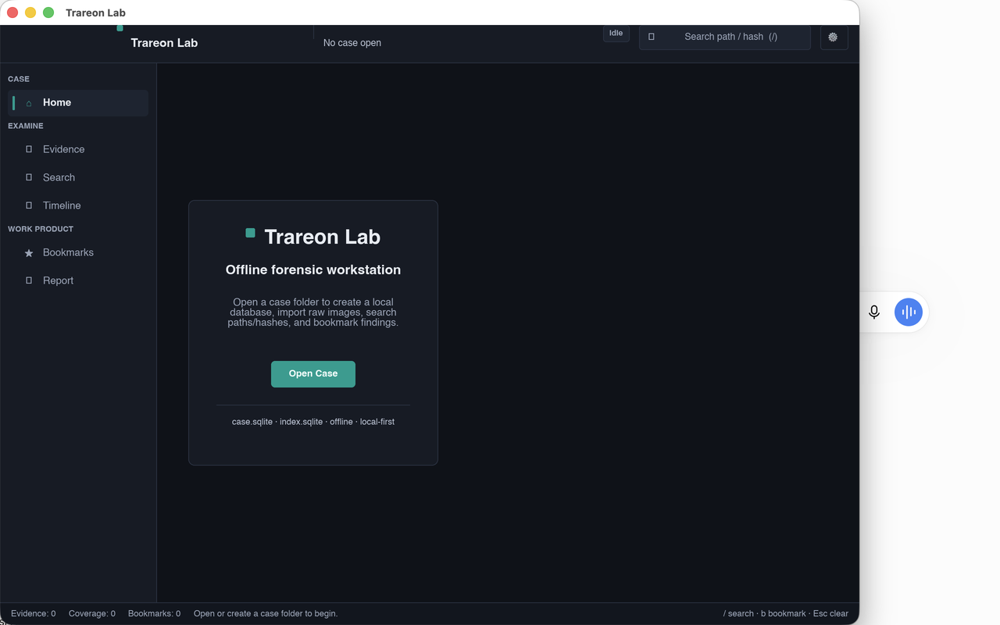

# Trareon Lab

**Offline digital-forensic examination workstation.**

Open a case folder, import raw disk images, search paths and hashes, bookmark findings — all local, no cloud dependency.

<p align="center">
  
</p>

<p align="center">
  <a href="LICENSE"></a>
  <a href=".github/workflows/ci.yml"></a>
  
  
</p>

## What you get

| Area | Capability |
|---|---|
| **Case** | Local `case.sqlite` + `index.sqlite` per case folder |
| **Evidence** | Raw / dd / img / bin ingest with hash + provenance |
| **Search** | Path, name, and hash lookup against the case index |
| **Bookmarks** | Examiner citations persisted in the case DB |
| **UI** | Institutional dark-lab shell · Dark/Light · EN/ID |

Honest empty states: timeline and PDF export are **not** claimed in v1.

## What this is not

- Not ISO-accredited, not court-ready
- Installers are typically **unsigned** (Gatekeeper / SmartScreen warnings) — see [`docs/SELLING-UNSIGNED.md`](docs/SELLING-UNSIGNED.md)
- Product binaries are **not** attached to GitHub Releases — source here, binaries on the storefront

## Supported OS (limited matrix)

| OS | Versions | Arch |
|---|---|---|
| Windows | 10 22H2, 11 23H2/24H2 | x64 |
| macOS | 14, 15 | arm64 |
| Linux | Ubuntu 22.04/24.04, Debian 12, Kali (lab) | x86_64 |

Outside this table = not claimed.

## Get the binary

Buy / download from the operator storefront (Lynk.id / Gumroad), verify SHA-256, then install per [`docs/SELLING-UNSIGNED.md`](docs/SELLING-UNSIGNED.md).

Source for each freeze SHA stays on this repo under **GPL-3.0-only**.

Details: [`docs/DISTRIBUTION-STOREFRONT.md`](docs/DISTRIBUTION-STOREFRONT.md) · [`docs/SELLING-PAGE.md`](docs/SELLING-PAGE.md)

## Develop

```bash
# Library / CLI workspace (no GUI display required)
cargo test --workspace --exclude lab-slint
cargo test -p lab-slint --no-default-features

# Full GUI (needs a display)
cargo run -p lab-slint --bin trareon-lab --features gui
```

Smoke packaging: `./packaging/smoke.sh`

## Examiner flow

```text
Open / create case folder
  → Import raw image (.dd / .raw / .img / .bin)
  → Browse evidence · Search path/hash · Bookmark
  → Reopen the same folder — ledger + index survive
```

Keyboard: `/` search · `b` bookmark · `Esc` clear

## Docs

| Doc | Purpose |
|---|---|
| [`PRD-Digital-Forensic-Analysis-Lab.md`](PRD-Digital-Forensic-Analysis-Lab.md) | Product requirements |
| [`RFC-Digital-Forensic-Analysis-Lab.md`](RFC-Digital-Forensic-Analysis-Lab.md) | Architecture RFC |
| [`docs/RELEASE-01-CAPABILITY-MATRIX.md`](docs/RELEASE-01-CAPABILITY-MATRIX.md) | R1 capability matrix |
| [`docs/KNOWN-ISSUES.md`](docs/KNOWN-ISSUES.md) | Known limits |

## License

**GNU General Public License v3.0 only** (`GPL-3.0-only`). See [`LICENSE`](LICENSE).
