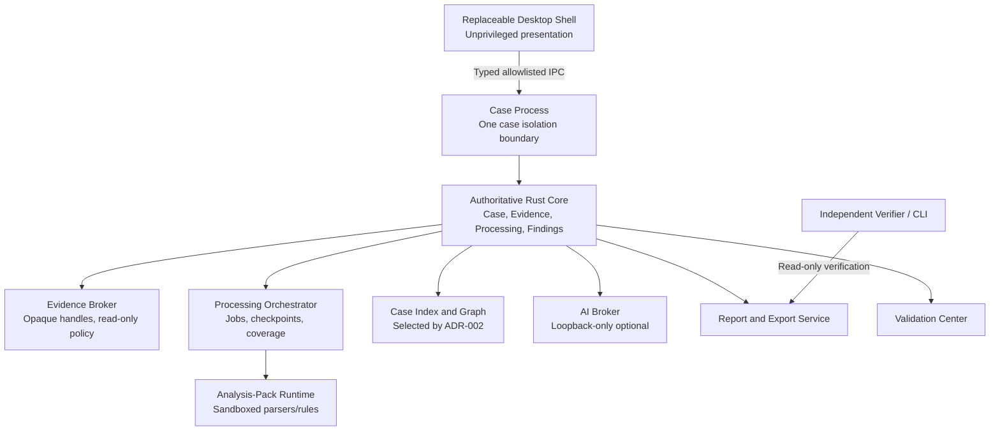

# RFC — Trareon Lab

## 1. Ringkasan

- **Nama produk:** Trareon Lab
- **Jenis produk:** Desktop digital-forensic analysis laboratory, install-first, offline-first
- **Baseline PRD:** `PRD-Digital-Forensic-Analysis-Lab.md` versi 1.0, finalisasi 17 Juli 2026
- **Status RFC:** Architecture Baseline Draft v0.1 — desktop shell and case index pending Gate A
- **Change control:** Perubahan normative memerlukan ADR update, traceability update, dan validation-impact review
- **Foundation plan:** `docs/superpowers/plans/2026-07-17-trareon-lab-rfc-foundation-preparation.md`
- **Architecture matrix:** `docs/ARCHITECTURE-DECISION-MATRIX.md`
- **Decision register:** `docs/DECISION-REGISTER.md`
- **Official remote:** `https://github.com/Trareon-com/Trareon-Lab`
- **Target OS:** Windows, macOS, Linux
- **Authoritative core:** Rust
- **Desktop shell:** replaceable presentation layer; selection controlled by ADR-001 and Gate A; **not accepted**
- **Case database/index:** selection controlled by ADR-002 and Gate A; **not accepted**
- **Konektivitas:** Full offline for deterministic forensics; optional loopback-only Ollama/LM Studio for AI assistance

Trareon Lab mengonsumsi paket `.fsnap` dari Trareon Acquire dan format evidence umum, lalu menyediakan intake verification, processing, examination, interpretation, correlation, review, reporting, validation, dan case closure. Produk diposisikan sebagai case-centric, defensible laboratory — bukan kumpulan viewer atau tombol parser.

RFC ini membekukan batas arsitektur yang sudah dikunci PRD dan ADR produk, serta menetapkan bahwa shell desktop hanya boleh dipilih setelah `docs/ARCHITECTURE-DECISION-MATRIX.md` mencatat `PASS` untuk satu kandidat pada seluruh mandatory gate Windows/macOS/Linux.

### 1.1 Prinsip yang tidak boleh dilanggar

1. Validitas dan transparansi lebih penting daripada jumlah parser.
2. Evidence, deterministic result, AI suggestion, dan human conclusion berada pada lapisan berbeda.
3. Tidak ada status sukses yang menyembunyikan data gagal, dilewati, tidak didukung, rusak, atau ambigu.
4. Seluruh hasil penting mempunyai lineage ke evidence source.
5. Capability claim selalu dibatasi oleh fungsi, format, versi, OS, dataset validasi, dan known limitation.
6. Produk mendukung proses laboratorium; produk tidak menggantikan kewenangan, kompetensi, SOP, legal review, atau keputusan pengadilan.
7. UI/shell tidak pernah menjadi authoritative forensic decision plane.

### 1.2 Terminologi klaim

Produk boleh menyatakan bahwa implementasi:

- selaras dengan atau mendukung workflow yang dipetakan ke sumber dan edisi tertentu;
- telah lulus test tertentu pada kombinasi build, OS, hardware, dan konfigurasi tertentu;
- menghasilkan record yang dapat membantu legal/quality review.

Produk tidak boleh menyatakan bahwa:

- Trareon Lab adalah software ISO-certified, ISO/IEC 17025 compliant tool, atau ISO/IEC 17043 accredited software;
- hasil otomatis court-ready, court-approved, atau court-admissible;
- seluruh evidence telah ditemukan atau suatu metode bebas error;
- hash saja membuktikan perolehan sah atau bahwa file yang cocok NSRL otomatis aman.

## 2. Problem Statement

Examiner digital forensik menghadapi tool fragmentation, false completeness, opaque parser trust, weak reproducibility, lost provenance, silent parser failure, bias dari heuristic/AI, serta kebutuhan Indonesia-first untuk bahasa, zona waktu, PII lokal, dan profil regulasi. Trareon Lab harus menyelesaikan masalah tersebut dalam satu workspace offline tanpa bergantung pada aplikasi forensik eksternal dan tanpa menjadikan AI sebagai otoritas keputusan.

### 2.1 Mengapa solusi ini dipilih

Arsitektur yang dipilih memisahkan:

- **Evidence Plane** — bytes, hashes, manifests, signatures, immutable source references;
- **Deterministic Analysis Plane** — parsers, search, carving, timeline, correlation, run manifests;
- **AI Assistance Plane** — optional local suggestions with citations;
- **Human Decision Plane** — notes, findings, reviews, authorizations, amendments.

Rust menjadi authoritative core karena memory safety, kontrol I/O, shared library/CLI potential, dan kemampuan menjaga forensic business logic di luar UI. Presentation shell tetap replaceable agar Gate A dapat memilih stack berdasarkan pengukuran, bukan preferensi. Satu case per isolated process mencegah cross-case contamination. Analysis packs berjalan di sandbox dengan capability broker. `.fsnap` diimpor read-only tanpa silent repair.

## 3. Goals

1. Menyediakan workspace offline untuk disk, filesystem, artefak desktop, RAM, network capture, file, dan media dengan provenance terpadu.
2. Menjaga evidence asli immutable dan setiap derived result dapat ditelusuri ke input serta metode.
3. Menghilangkan false completeness melalui typed integrity state, coverage map, transparent errors, dan report blocking.
4. Mendukung repeatability, reproducibility, independent scrutiny, method validation, technical review, dan report authorization.
5. Mengurangi backlog melalui streaming pipeline, persistent index, partial results, checkpoint/resume, dan resource-aware parallelism.
6. Menyediakan bantuan AI lokal opsional yang evidence-cited, case-scoped, dan selalu di bawah keputusan manusia.
7. Menyediakan dokumentasi offline, validation evidence, limitation matrix, dan Indonesia regulatory profile sebagai release gate.
8. Memungkinkan shell desktop diganti tanpa menulis ulang forensic core.

## 4. Non-Goals

- Akuisisi fisik perangkat sebagai pengganti Trareon Acquire.
- Remediation, quarantine, process termination, deletion, atau perubahan target system.
- Malware detonation pada workstation utama.
- Public sandbox submission atau threat-intelligence lookup tanpa connected companion terpisah.
- OpenAI, OpenRouter, atau provider AI berbasis internet.
- Verdict otomatis tentang guilt, intent, malware, authenticity, identity, atau admissibility.
- Klaim sertifikasi, akreditasi, atau admissibility otomatis.
- Formal administration platform untuk penyelenggara proficiency-testing ISO/IEC 17043.
- Portable edition dengan feature parity pada rilis P0.
- Central collaborative server dan cross-case intelligence secara default.
- Memilih desktop shell atau case index sebelum Gate A `PASS`.
- Production forensic parsers di dalam Gate A spikes.

## 5. Keputusan Arsitektur

### 5.1 Keputusan yang dikunci sekarang

| Area | Keputusan | ADR / bukti |
|---|---|---|
| Authoritative forensic core | Rust | Foundation plan global constraint; PRD Lampiran B |
| Presentation shell | Replaceable; not selected | ADR-001 `PROPOSED`; Gate A matrix |
| Case database/index | Not selected | ADR-002 `PROPOSED`; Gate A matrix |
| Case isolation | One open case per isolated application process; no writable cross-case state | ADR-004 `PROPOSED` pending Gate C/D evidence; PRD FR-CASE-006–008 |
| Evidence immutability | Source bytes read-only; derived artifacts content-addressed | PRD FR-EVI; ADR-006 |
| `.fsnap` import | Read/import verification only; no silent rewrite | ADR-006 `PROPOSED` |
| Local AI | Optional loopback Ollama/LM Studio; suggestion-only | ADR-007 `PROPOSED`; ADR-014 `ACCEPTED` for P0 optional priority |
| Priority model | P0 / P2 / companion only; no P1 feature bucket | ADR-013 `ACCEPTED` |
| Second-method + blind PT participant support | P0 capabilities | ADR-015 `ACCEPTED` |
| Minimum digest | SHA-256 | Foundation plan; PRD integrity model |
| Candidate signature algorithm | Ed25519 pending Gate C crypto profile | ADR-003 `PROPOSED` |
| Serialization | JSON/JSONL; canonical JSON for signed objects | Foundation plan |
| Official remote | Private `Trareon-com/Trareon-Lab` | ADR-016 `ACCEPTED` |

### 5.2 Kandidat Gate A yang belum diterima

| Area | Kandidat yang diukur |
|---|---|
| Desktop shell | Tauri 2 + Svelte 5; Slint + Rust; Avalonia + Rust FFI |
| Case database/index | Bundled SQLite-only; SQLite plus embedded index engine; purpose-built Rust index |

Seleksi hanya terjadi setelah `docs/ARCHITECTURE-DECISION-MATRIX.md` mencatat raw measurements dan `PASS` pada seluruh mandatory gate. RFC amendment wajib menyertakan kandidat terpilih, skor, dan tautan bukti.

### 5.3 Hermetic offline policy

Semua runtime dependency resmi harus:

- di-static-link bila aman dan kompatibel, atau dibundel di dalam official package;
- dipin source dan versinya;
- memiliki hash, license, provenance, dan validation coverage;
- tidak diunduh pada startup atau saat casework;
- tidak dicari dari PATH sebagai dependency tersembunyi untuk kemampuan P0;
- dapat diganti hanya melalui signed offline update/pack.

Ollama dan LM Studio adalah optional external loopback services yang dikelola pengguna. Ketiadaan keduanya tidak boleh menghentikan deterministic workflow.

### 5.4 Build identity

Setiap binary dan output menyimpan:

- semantic version;
- immutable build ID;
- source revision;
- dirty-tree flag;
- toolchain dan target triple;
- enabled feature flags;
- dependency lock digest;
- SBOM digest;
- signing identity;
- capability matrix version;
- validation pack version.

## 6. Arsitektur Tingkat Tinggi



### 6.1 Trust boundary

| Boundary | Trust level | Aturan |
|---|---|---|
| Desktop shell / UI | Tidak tepercaya untuk keputusan forensik | Tidak boleh mengakses arbitrary path, menulis evidence, atau menentukan completion semantics |
| IPC command layer | Mediasi | Allowlist, schema validation, size limits, correlation IDs, authentication of peer process |
| Rust core | Authoritative | Case state, provenance, coverage, findings lifecycle, report gates |
| Evidence broker | Tepercaya defensif | Opaque handles; no raw path leakage to UI/pack/AI |
| Analysis-pack runtime | Semi-trusted / hostile input | No network default; no arbitrary path; bounded resources; crash containment |
| AI broker | Untrusted output | Loopback only; citations required; no approval authority; evidence treated as hostile prompt data |
| Source evidence | Tidak tepercaya | Malformed, adversarial, or deceptive content assumed |
| Derived store / index | Tidak tepercaya sampai diverifikasi | Content-addressed objects; recoverable from source + run manifests when possible |

### 6.2 Lapisan produk

1. **Evidence Plane:** raw evidence, `.fsnap`, received hashes, manifests, signatures, acquisition records, immutable source references.
2. **Deterministic Analysis Plane:** parsers, search, carving, timeline, entity extraction, correlation, YARA/Sigma evaluation, measurements, run manifests.
3. **AI Assistance Plane:** local natural-language query, prioritization, hypothesis prompts, narrative/report drafts, citation checks.
4. **Human Decision Plane:** notes, observations, hypotheses, findings, review, disagreements, authorization, amendments, conclusions.

## 7. Struktur Repository dan Komponen

Struktur target setelah Gate A memilih shell (nama paket UI menyesuaikan kandidat terpilih):

```text
Trareon Lab/
  PRD-Digital-Forensic-Analysis-Lab.md
  RFC-Digital-Forensic-Analysis-Lab.md
  Research/
  docs/
  schemas/
  crates/
    lab-core/           # authoritative forensic core
    lab-evidence/       # evidence broker, integrity, .fsnap import
    lab-process/        # orchestrator, coverage, checkpoints
    lab-index/          # selected index adapter after ADR-002
    lab-pack-runtime/   # sandbox host and capability broker
    lab-ai-broker/      # loopback provider adapter
    lab-report/         # report/export/verifier helpers
    lab-ipc/            # typed IPC schemas and transport
  apps/
    lab-shell/          # selected desktop shell
    lab-verifier/       # independent CLI verifier
  spikes/               # Gate A equal spikes only
  packs/                # signed analysis packs after Gate D
```

### 7.1 Tanggung jawab komponen

| Unit | Tanggung jawab | Tidak boleh dilakukan |
|---|---|---|
| Desktop shell | Window, navigation, presentation, accessibility | Menentukan completion atau memproses raw evidence langsung |
| Case service | Lifecycle, roles, scope, audit, retention, examination plan | Membypass evidence broker |
| Evidence broker | Read-only handles, identity, ranges, access policy | Memberi arbitrary path ke UI/pack/AI |
| Processing orchestrator | Jobs, resources, checkpoints, coverage | Menyembunyikan failure atau mengubah result semantics |
| Analysis-pack runtime | Sandboxed parsing/rules | Network, arbitrary path, evidence write, unlimited resource |
| Index/evidence graph | Search, normalized facts, provenance relationships | Menghapus raw values atau uncertainty |
| AI broker | Loopback provider, context/citation policy | Shell, internet, approval, unscoped raw evidence |
| Findings/review service | Typed reasoning records dan approvals | Mengubah source evidence atau audit history |
| Report/export service | Controlled rendering, manifest, signatures | Menghilangkan limitation/deviation/error material |
| Validation Center | Method registry, tests, dossiers, status | Mempromosikan capability berdasarkan tombol/tanggal |
| Independent verifier | Memeriksa package, audit, signatures, hashes | Mempercayai status dari UI tanpa verifikasi |

## 8. Case Process Lifecycle dan Locking

### 8.1 Isolation model

- Dashboard utama dapat menampilkan case list tanpa membuka raw case data.
- Membuka case membuat isolated process/window.
- Case caches, indexes, temporary extraction directories, AI context, dan logs tidak boleh writable lintas case.
- Cross-case transfer hanya melalui signed export/import yang diaudit pada kedua case.
- Internal cross-case clipboard, drag-and-drop, AI context, dan search diblokir pada P0.

### 8.2 Locking

- Case workspace memperoleh exclusive lock saat dibuka.
- Proses kedua harus gagal dengan alasan eksplisit bila lock masih dipegang.
- Crash recovery harus mendeteksi stale lock melalui process liveness check yang aman untuk OS target, lalu menawarkan verified recovery path.
- Lock release adalah prasyarat reopen oleh proses lain.

### 8.3 Lifecycle states

`Request → Acceptance/Scope → Intake → Verification → Processing → Examination → Interpretation → Review → Reporting → Amendment → Closure → Retention/Disposition`

Examination plan berversi (FR-CASE-016) disimpan sebelum/during examination; perubahan membuat versi baru tanpa menghapus versi sebelumnya.

## 9. Worker Pools, Cancellation, Backpressure, dan Crash Recovery

- Processing orchestrator memakai bounded queues dan resource budgets.
- Job mendukung pause, resume, cancel, checkpoint, retry, dan reprioritize.
- Retry/resume harus idempotent dan tidak membuat duplicate derived objects.
- Parser failure diisolasi; crash worker tidak boleh menandai coverage sebagai `Complete` atau “no artifact found”.
- Partial results yang sudah tervalidasi dapat ditinjau saat processing lain masih berjalan.
- Forced termination, disk-full, parser hang/crash, dan removable-media disconnect mempunyai deterministic recovery tests.
- Checkpoint bersifat transactional dan diverifikasi sebelum resume.

## 10. Model Data dan Persistence Boundaries

### 10.1 Entitas utama

Case, EvidenceItem, ExaminationAction, DerivedObject, ProvenanceRecord, CoverageRecord, RunManifest, Finding, ReviewRecord, Report, ExportPackage, MethodRecord, ValidationDossier, ExaminationPlan, AuditEvent.

### 10.2 Persistence boundaries

| Store | Isi | Aturan |
|---|---|---|
| Source evidence | Original packages/images/files | Immutable; never rewritten by Lab |
| Case metadata DB | Case records, roles, reviews, plans | Selected by ADR-002; portable with case directory |
| Search/index store | Indexed facts and postings | Selected by ADR-002; rebuildable from source + run manifests when feasible |
| Content-addressed blob store | Derived artifacts, previews, extracts | Keyed by content digest + provenance |
| Audit log | Append-only hash-chained events | Corrections via superseding events only |
| AI suggestion store | Derived suggestions and context manifests | Never authoritative findings |
| Export packages | Signed/verifiable outputs | Independent of UI process |

### 10.3 Migration/versioning policy

- Case schema versions dipin per release.
- Forward migrations harus deterministic dan diaudit.
- Unsupported older/newer schemas fail explicitly.
- Capability/status changes yang memengaruhi result semantics muncul di release notes dan dapat memicu revalidation/reprocessing.

## 11. API / IPC Boundary

- Shell berbicara hanya melalui typed allowlisted commands.
- Setiap request mempunyai correlation ID, authenticated peer identity, schema version, and size limit.
- Input validation terjadi di Rust core sebelum side effect.
- Error contract membedakan user-correctable, retryable, unsupported, integrity-critical, dan internal failures.
- Permissions/roles ditegakkan di core: Examiner, Technical Reviewer, Administrative Reviewer, Report Authorizer, Administrator, Validation Lead.
- Separation of duties mencegah self-approval finding/report bila policy lab mensyaratkannya.

## 12. Analysis-Pack Runtime dan Capability Broker

- Packs bertanda tangan, berversi, mempunyai permission/resource manifest, SBOM, limitation, dan validation status.
- Default: no network, no arbitrary filesystem, no evidence write, bounded CPU/memory/time.
- Capability broker memberikan opaque handles dan declared operations saja.
- Pack crash terkandung; orchestrator merekam failure dengan reason code dan impact.
- Hostile evidence dianggap mampu mengeksploitasi parser; preview P0 tidak mengeksekusi macro, script, embedded URL, external resource, autorun, atau arbitrary codec/plugin.
- Tidak ada pack yang mengeksekusi case evidence sebelum Gate D menerima sandbox contract.

## 13. `.fsnap` Import Pipeline

```text
Select package → Schema/version check → Manifest/hash/signature/audit continuity/path-safety checks
→ Typed integrity state → Register Evidence IDs → Coverage/gap/limitation import
→ Read-only analysis mounts via evidence broker
```

Aturan:

- Source package tidak diubah.
- Unsupported version gagal secara eksplisit.
- Ketiadaan anchor menghasilkan `ComputedUnanchored`, bukan `VerifiedMatch`.
- Critical mismatch fail-closed untuk report final tetapi tetap dapat didokumentasikan.
- Exact import contract, fixtures, dan hostile-input tests dimiliki Gate C / ADR-006.

## 14. Local AI Adapter Boundary

- Provider resmi: Ollama dan LM Studio pada loopback default.
- Non-loopback endpoint ditolak pada official offline profile.
- AI context broker menerapkan case scope, legal scope, minimization, excerpt preview, token/resource budget, dan auditable source selection.
- Evidence content adalah untrusted data; instruction di dalam evidence tidak memperoleh tool authority.
- Tool calling disabled by default; bila diaktifkan hanya read-only allowlisted deterministic functions tanpa shell/network/arbitrary path/write/delete/approval.
- Material claims tanpa valid citation diberi label unsupported.
- AI output adalah derived suggestion; tidak otomatis menjadi tag final, finding, case status, atau conclusion.
- Record provider/runtime/model/prompt/context/parameters/output/reviewer metadata.
- Boundary tests dimiliki Gate D / ADR-007.

## 15. Alur Utama

### 15.1 Casework

`Case Request → Acceptance/Scope → Evidence Intake → Integrity/Coverage Verification → Examination Plan → Deterministic Processing → Partial Review → Examination/Correlation → Hypotheses → Findings → Technical Review → Administrative Review → Authorization → Signed Report/Export → Closure/Retention`

### 15.2 Validation before casework

Method tidak dipakai pada official casework sebelum capability/limitation function-based testing direkam (FR-VAL-011 / SRC-SWGDE-TEST). Validation dossier mencakup positive/negative/boundary/malformed/adversarial/partial/unsupported/repeatability/reproducibility/performance/differential tests bila feasible.

### 15.3 Second-method verification

Casework dapat merekam method A vs method B, outputs, discrepancy, reviewer disposition, dan residual risk. Perbedaan tidak diselesaikan dengan majority-vote diam-diam (FR-VAL-009).

### 15.4 Blind proficiency exercise

Import blind challenge dan export signed participant result dengan isolation, embargoed expected results, scheme/round ID, dan submission lock. Scheme design/scoring/provider impartiality di luar scope (FR-VAL-010).

## 16. Edge Case dan Failure Mode

| Failure | Perilaku yang diwajibkan |
|---|---|
| App/OS crash mid-job | Verified checkpoint resume atau explicit incomplete coverage; no silent omission |
| Disk full | Preflight/forecast; fail closed with recoverable state |
| Parser hang/crash | Contained failure; Parser Failure Inbox; coverage not `Complete` |
| Removable media disconnect | Deterministic interruption record and recovery path |
| Stale case lock | Liveness-checked recovery UX; no silent dual open |
| Integrity mismatch | Typed state; block final report until disclosed/disposed |
| AI provider missing | Deterministic workflows continue; AI features unavailable with explicit status |
| Unsupported `.fsnap` version | Explicit reject; no silent repair |
| Pack sandbox escape attempt | Kill/contain; security audit event; pack marked unsafe |
| Update available | Show impacted methods/cases and revalidation implications before apply |

## 17. Packaging, Signing, SBOM, dan Offline Update

- Distribusi utama: signed installer per official OS matrix.
- Portable edition bukan syarat P0.
- Installers, core, helpers, packs, rules, symbols, updates, dan official documentation harus signed dan diverifikasi sebelum digunakan.
- Setiap release menghasilkan SBOM, third-party license inventory, capability matrix, known issues, dan support period.
- Offline update bundles adalah satu-satunya jalur update resmi.
- Exact signing/notarization matrix menunggu ADR-009 / Gate E platform docs.

## 18. Test Pyramid dan Platform CI Matrix

| Layer | Isi |
|---|---|
| Unit | Core pure functions, schema validation, integrity state transitions |
| Contract | IPC schemas, provenance, coverage, `.fsnap` fixtures after Gate C |
| Integration | Case lock, orchestrator checkpoint/resume, export/verify round-trip |
| Adversarial | Hostile archives/docs/media, AI prompt injection, pack escape attempts |
| Validation corpora | Golden datasets, CFTT-inspired function tests, differential tests |
| UI/platform smoke | Accessibility, keyboard-first, installer smoke on official OS matrix |
| Gate A spikes | Equal synthetic million-row workflow and measurement protocol |

CI harus membedakan community/source checks dari official signed validation. Tidak ada promotion `Validated` tanpa approved dossier.

## 19. Phasing

| Phase | Isi | Gate |
|---|---|---|
| Architecture selection | Equal spikes, matrix measurements, ADR-001/002 acceptance | Gate A |
| Release boundary | R1 capability matrix and roadmap | Gate B |
| Evidence trust | `.fsnap`, provenance, crypto, audit, isolation contracts | Gate C |
| Safety and validation | Threat model, pack sandbox, corpora, false-positive policy | Gate D |
| Delivery | Platforms, performance profile, docs, Foundation implementation plan | Gate E |
| Foundation implementation | Case, authority, `.fsnap`, provenance, audit, coverage, validation harness, docs skeleton | After Gate E |

Production application code di luar spikes tidak dimulai sebelum Gate A `PASS` untuk shell dan index, serta gate terkait untuk jalur yang disentuh.

## 20. Open Questions Controlled by Later Gates

Open questions ini tidak mengubah requirement PRD v1.0; jawabannya dikunci oleh ADR/gate berikut:

1. Desktop shell selection — ADR-001 / Gate A.
2. Case database/index selection — ADR-002 / Gate A.
3. Cryptographic profile — ADR-003 / Gate C.
4. Reference hardware profiles — ADR-009 / Gate E.
5. Exact first-release OS/distribution/build matrix — ADR-009 / Gate E.
6. Decoder/codec licensing allowlist — ADR-010 / Gate E.
7. Memory-engine strategy — ADR-011 / Gate E.
8. Role identity binding model — Gate C/D identity profile.
9. Encrypted workspace key recovery model — Gate C/D.
10. CASE/UCO tested subset — ADR-012 / Gate C.
11. Named Indonesian legal/quality reviewers before Official Production — Gate E review.
12. Exact R1 vertical-slice formats/artifacts — ADR-008 / Gate B.

## 21. Acceptance of This RFC Draft

RFC v0.1 diterima sebagai architecture baseline draft apabila:

- batas Rust-core, case isolation, evidence immutability, pack sandbox intent, AI loopback boundary, dan `.fsnap` read-only import konsisten dengan PRD v1.0;
- Gate A matrix dan spike scaffolds ada;
- ADR-001 dan ADR-002 tetap `PROPOSED` sampai measurements `PASS`;
- tidak ada klaim sertifikasi/akreditasi/admissibility;
- tidak ada production forensic parser yang diotorisasi oleh dokumen ini.

RFC amendment berikutnya yang memilih shell/index harus menautkan raw measurements dan mengubah ADR-001/ADR-002 menjadi `ACCEPTED` hanya setelah Gate A `PASS`.
