# Trareon Lab — complete examiner tutorial

**Audience:** digital forensic examiners and lab engineers  
**Build:** Engineering Alpha · **UNSIGNED** · Lab use only · **NOT court-ready** · **NOT ISO-certified**

> Bahasa UI: preferensi gear → **ID / EN**. Tutorial ini berbahasa Inggris agar selaras dengan README GitHub; alur kerjanya sama di locale ID.

This tutorial walks through the desktop workbench (`trareon-lab`) from empty install to report/export. Screenshots live under [`docs/media/`](../media/).

---

## 0. Install and run

### Binary (storefront)

1. Buy/download the OS archive from the operator storefront (see [`docs/SELLING-PAGE.md`](../SELLING-PAGE.md)).
2. Verify SHA-256 against the published `SHA256SUMS`.
3. On macOS/Windows expect Gatekeeper/SmartScreen warnings — see [`docs/SELLING-UNSIGNED.md`](../SELLING-UNSIGNED.md).
4. Launch `trareon-lab`.

### From source

```bash
git clone https://github.com/Trareon-com/Trareon-Lab.git
cd Trareon-Lab
cargo build -p lab-slint --bin trareon-lab --features gui --release
./target/release/trareon-lab
# or: cargo run -p lab-slint --bin trareon-lab --features gui
```

### Try without your own evidence

1. On **Home**, click **Load demo case** (or palette → *Load Demo Case*).
2. Lab opens an ephemeral case labelled `DEMO · demo-disk.dd` and imports [`testdata/demo/demo-disk.dd`](../../testdata/demo/demo-disk.dd).
3. Open **Evidence** → **Run carving** to see signature hits (jpg/pdf/gif/zip/7z, …).

Or use **Quick Verify**: pick any local file → hash + carve without building a custody case (banner: *ephemeral · not a custody case*). Env: `TRAREON_QUICK_VERIFY_PATH`.

Headless / CI (no display):

```bash
cargo test --workspace --exclude lab-slint
cargo test -p lab-slint --features gui
```

Automation helpers (skip file dialogs):

```bash
export TRAREON_CASE_DIR=/path/to/case-folder
export TRAREON_IMPORT_PATH=/path/to/image.dd
export TRAREON_TIMELINE_CSV=/path/to/plaso-or-hayabusa.csv   # optional
```

---

## 1. Understand the workbench chrome

```text
┌─ Disclosure (UNSIGNED / NOT court-ready) ─────────────────────────┐
├─ TopBar: brand · case · Search (/) · Nav · Inspector · Log · Prefs ┤
├─ Nav ─┬─ Main (active screen) ──────────────┬─ Inspector ────────┤
├───────┴─────────────────────────────────────┴────────────────────┤
│ Status: Evidence · Coverage · Bookmarks              [Log drawer] │
└──────────────────────────────────────────────────────────────────┘
```

| Region | Purpose |
|--------|---------|
| **Disclosure strip** | Always-on honesty banner — do not remove in demos |
| **TopBar** | Case title, artifact search chip, pane toggles, preferences |
| **Nav** | Case / Examine / Work product destinations (collapsible) |
| **Main** | Active examination screen |
| **Inspector** | File detail + hex for the current selection (survives nav) |
| **Status / Log** | Counts, progress, action ring buffer |

**Preferences:** gear icon → **ID / EN** language · **Dark / Light** theme.

**Keyboard**

| Key | Action |
|-----|--------|
| `/` | Open command palette (or search chip) |
| `1`–`6` | Jump Case / Evidence / Search / Timeline / Bookmarks / Report |
| `b` | Bookmark current selection |
| `Esc` | Close palette / clear selection |
| `?` | Keyboard cheat sheet |
| Palette | Toggle Nav / Inspector / Log |

---

## 2. Open or create a case

1. From **Home**, click **Open Case** (or palette → *Open Case*).
2. Choose an empty folder (new case) or an existing case folder that already contains `case.sqlite`.
3. Lab creates/opens local ledgers: `case.sqlite`, `index.sqlite`, audit trail.

**Pass:** TopBar shows the case title; status counters leave zero only if the folder is empty.

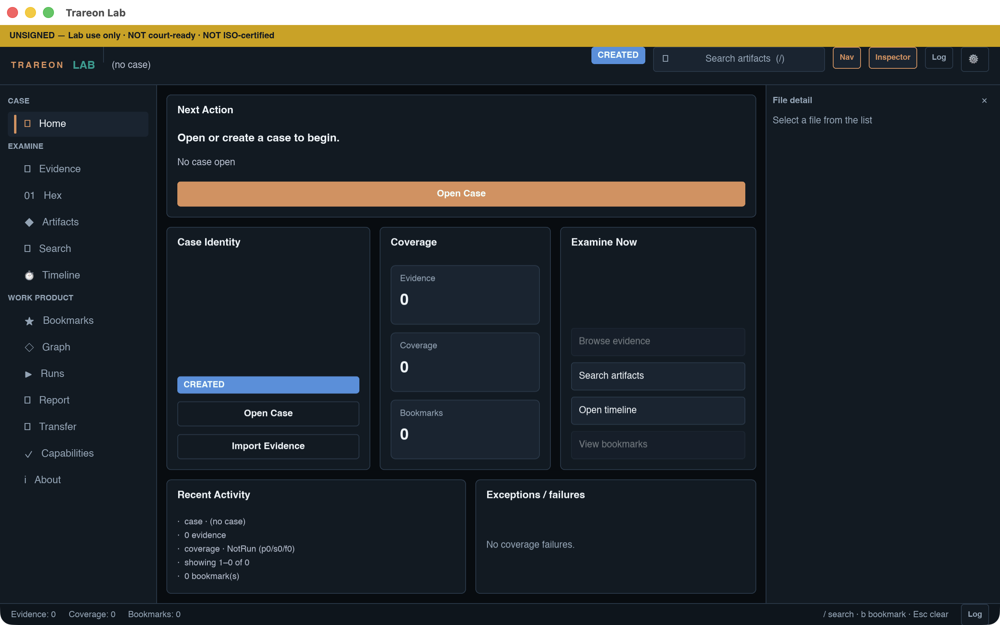

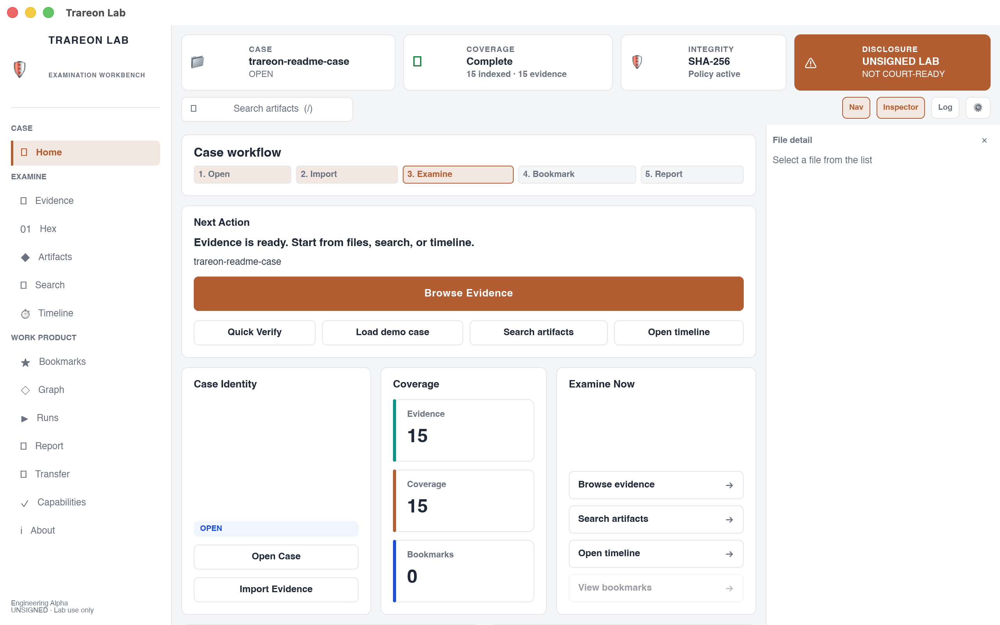

---

## 3. Import evidence

1. Click **Import Evidence** (Home, Evidence empty-state CTA, or palette).
2. Select a disk image: `.raw` / `.dd` / `.img` / `.bin` / `.e01`.
3. Watch the status bar progress; cancel is available while running.

**Pass:** Evidence count increments; rows show **designation** (e.g. forensic_copy / logical) and **integrity** chip; selecting a row fills the Inspector (path, size, hex).

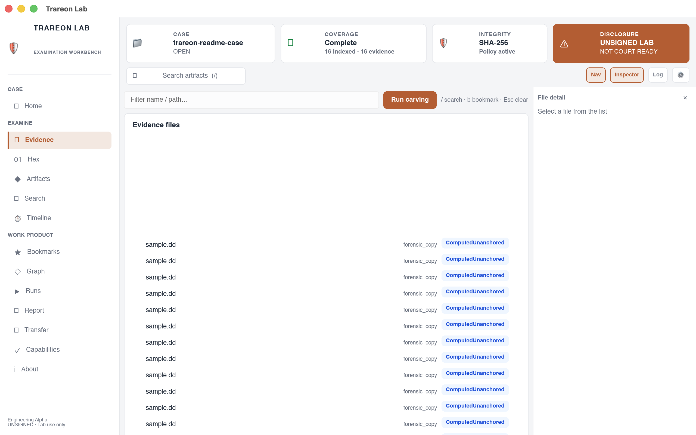

---

## 4. Examine — Evidence & Hex

1. Open **Evidence** in the nav.
2. Filter by name/path in the list toolbar.
3. Click a row → Inspector shows detail + hex dump (`LabSession::read_hex`).
4. Optional: **Hex** nav item explains that hex lives in the Inspector (honest empty / guidance).

**Pass:** No fabricated files; empty list if nothing imported.

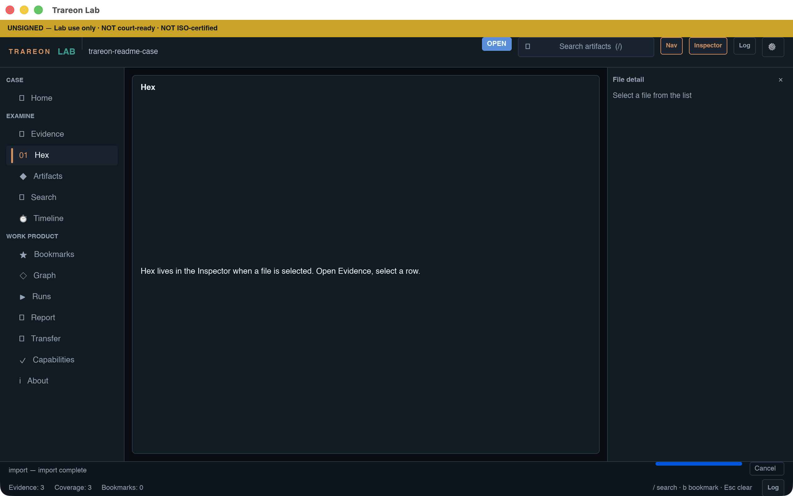

---

## 5. Search (with coverage honesty)

1. Open **Search**, or press `/` and run a query from the palette/chip.
2. Enter path / name / hash-oriented query supported by the case index.
3. Read the **Search coverage** banner: `complete` or `partial` (truncation disclosed — never silent).

**Pass:** Hits come from the real index; with `demo_seed` off (default) there are no invented matches.

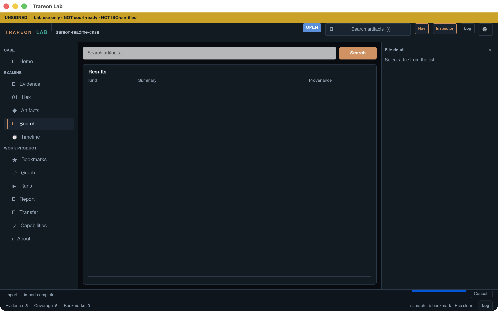

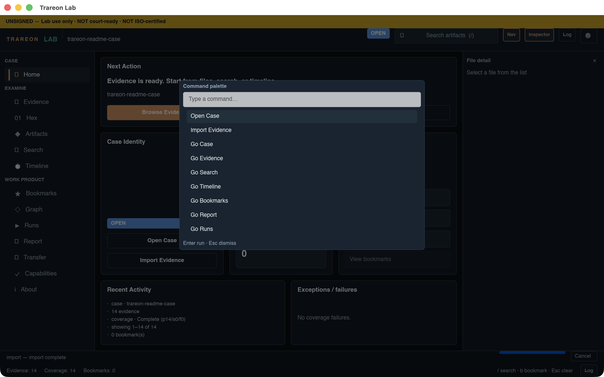

---

## 6. Timeline

1. Open **Timeline**.
2. If empty: that is honest — no synthetic events.
3. Optional: **Import timeline CSV (Plaso/Hayabusa)** to load external `l2tcsv`/CSV labels (sidecar workflow; tool need not be embedded).

**Pass:** Density strip + list appear only when labels exist.

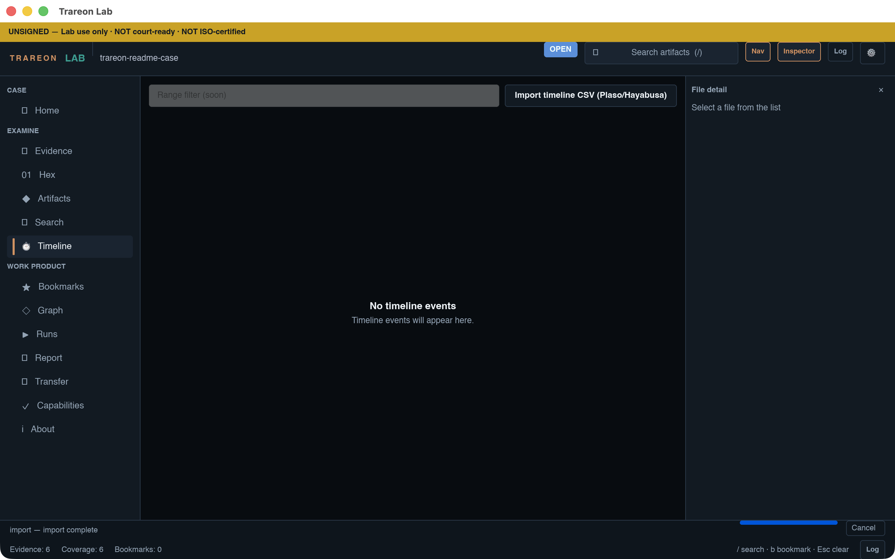

---

## 7. Bookmarks & tags

1. Select evidence (or a search hit).
2. Press `b` or **Add Bookmark** in the Inspector.
3. Open **Bookmarks** — findings become report claim material; Inspector may show **Tagged**.

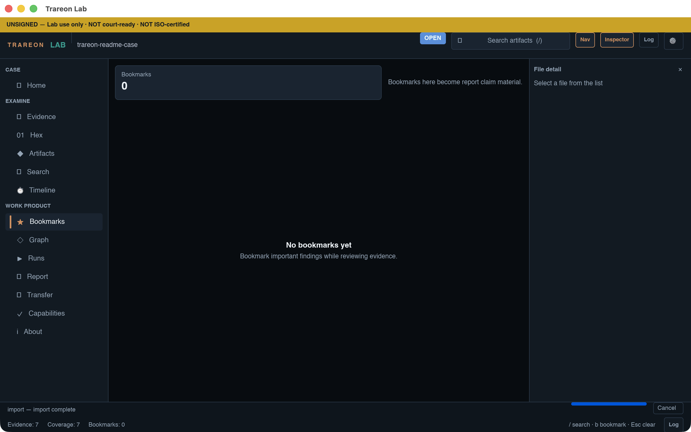

---

## 8. Artifacts, Graph, Runs

| Screen | Behavior |
|--------|----------|
| **Artifacts** | Parser results via search/intake — empty until real hits |
| **Graph** | Shows session correlation edges, or an honest empty state |
| **Runs** | RunManifest compare lines (second-method / tool pinning) |

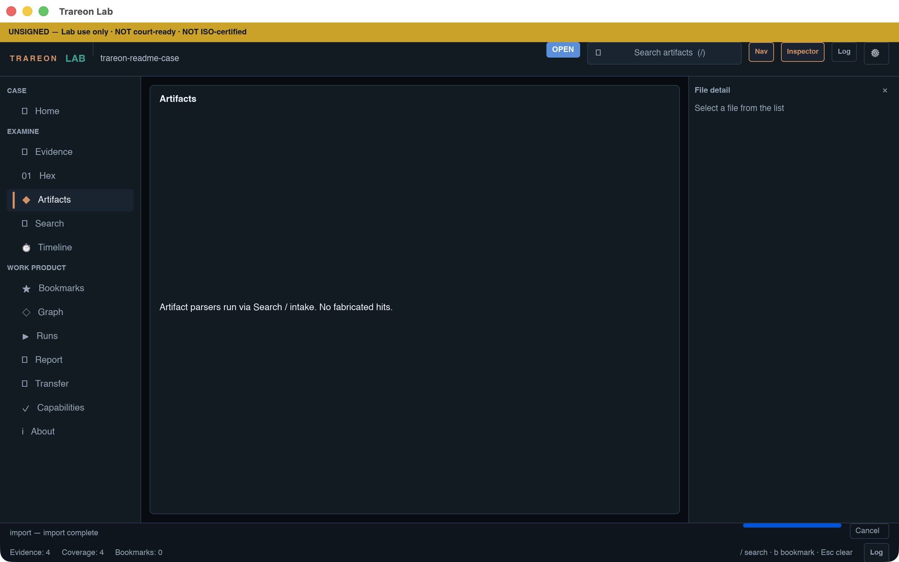

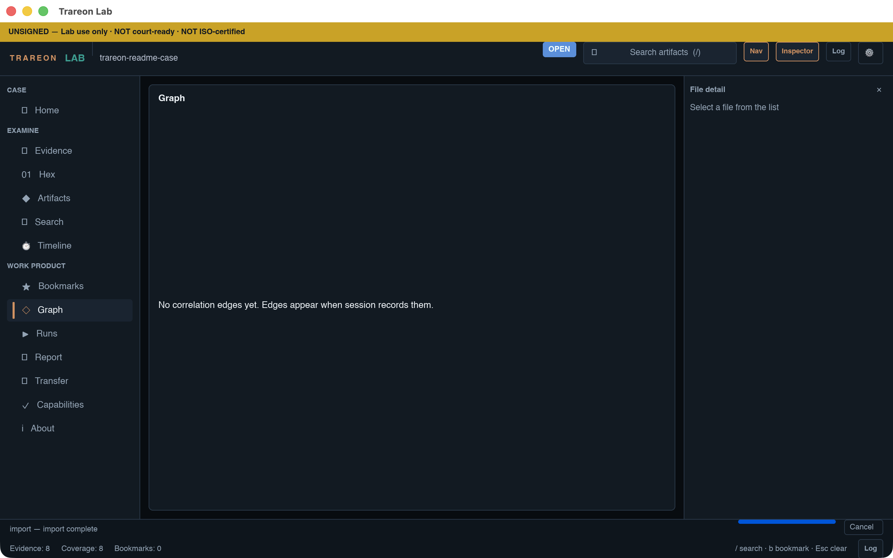

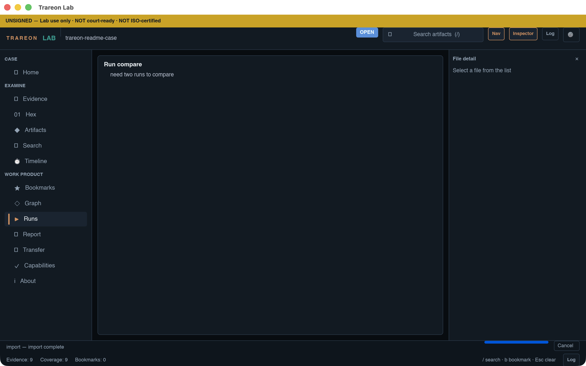

---

## 9. Report, SoD, export

1. Open **Report**.
2. Review **finalize blockers** and the SoD hint (examiner ≠ approver).
3. **Export report** writes format digests (HTML / PDF/A subset / CASE-UCO profile) when a case is open.
4. **Export transfer package** creates an Ed25519-signed offline pack; tamper verification marks **Invalid**.

**Pass:** Blocked finalize when intake/coverage/integrity gates fail — do not bypass honesty.

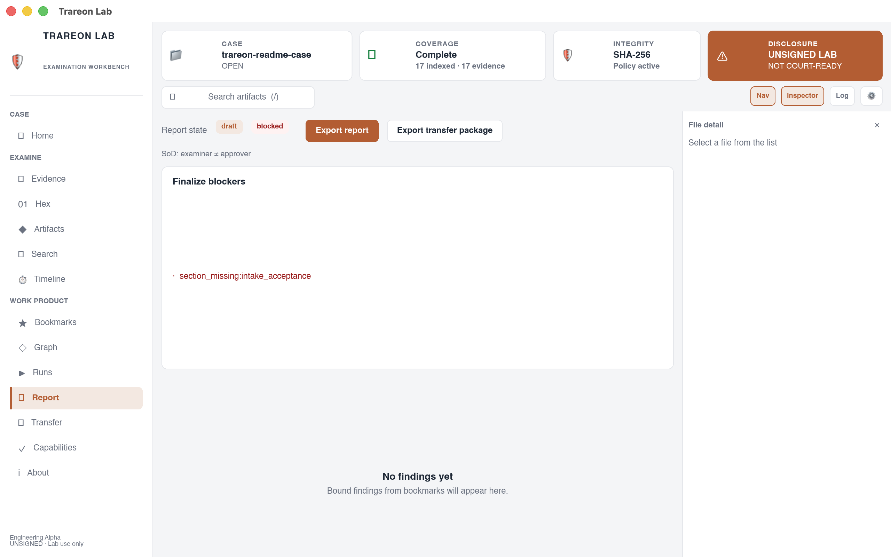

---

## 10. Transfer, Capabilities, About

- **Transfer** — package status / trust label after export.
- **Capabilities** — Validated vs deferred modules; follow dossiers under `docs/validation/`.
- **About** — SBOM / unsigned / not court-ready disclosure text.

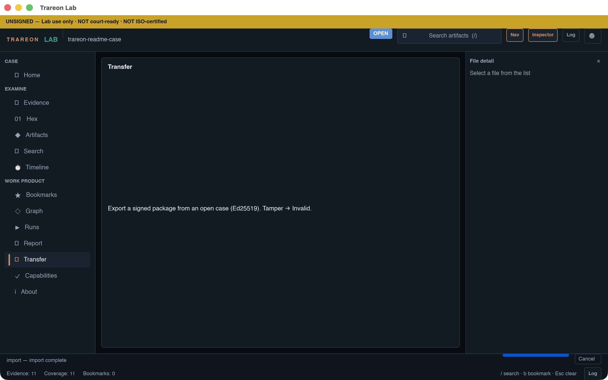

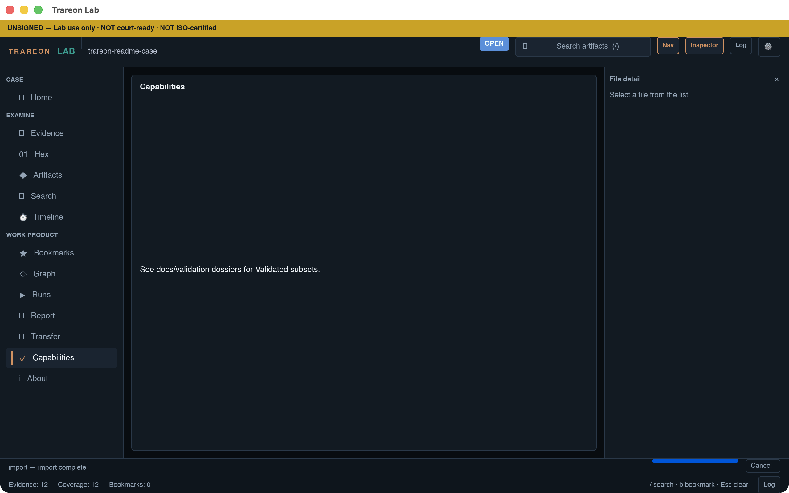

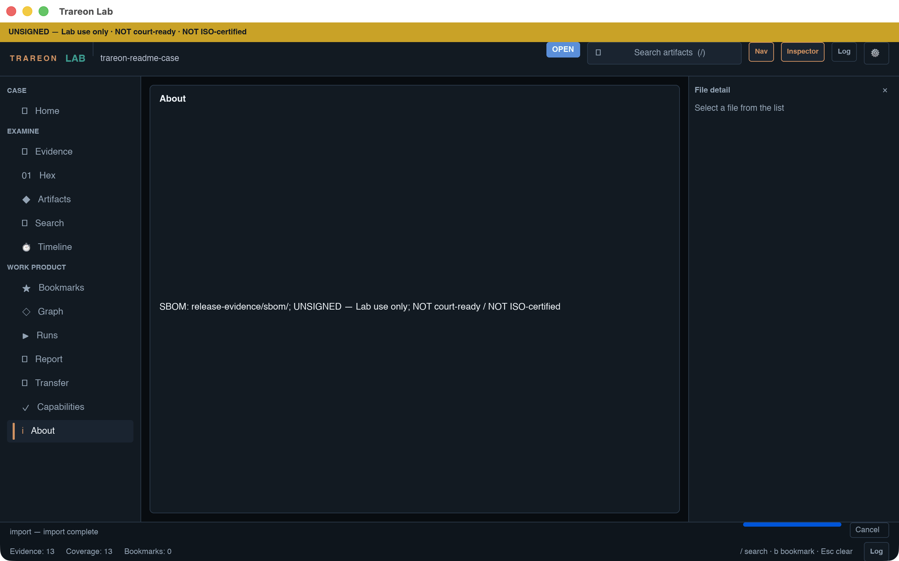

---

## 11. Five-task smoke (lab QA)

See [`docs/validation/EXAMINER-5TASK-SCRIPT.md`](../validation/EXAMINER-5TASK-SCRIPT.md):

1. Open case  
2. Import evidence  
3. Search + coverage banner  
4. Bookmark + Inspector  
5. Report blockers / export  

---

## 12. Limits (read before production use)

- Not ISO-accredited; not court-ready; installers typically unsigned.
- Mobile/cloud suites (AXIOM-class catalogs) are **out of scope** for this shell.
- Timeline/PDF/A are Validated **subsets** — see dossiers; do not claim universal compatibility.
- Product binaries are not published on GitHub Releases (source is GPL-3.0-only here).

---

## Related docs

| Doc | Purpose |
|-----|---------|
| [`docs/superpowers/specs/2026-07-18-dfir-workbench-research-ux.md`](../superpowers/specs/2026-07-18-dfir-workbench-research-ux.md) | Workbench design + competitive research |
| [`docs/validation/`](../validation/) | Golden dossiers (APFS, E01, search, YARA, export) |
| [`docs/SELLING-UNSIGNED.md`](../SELLING-UNSIGNED.md) | Unsigned install guidance |
| [`PRD-Digital-Forensic-Analysis-Lab.md`](../../PRD-Digital-Forensic-Analysis-Lab.md) | Product requirements |
